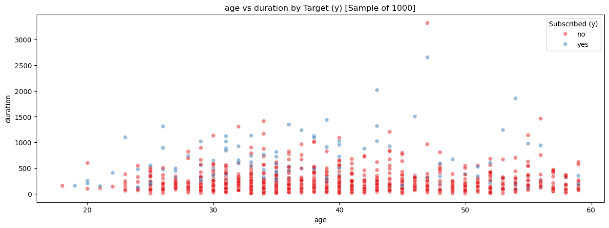
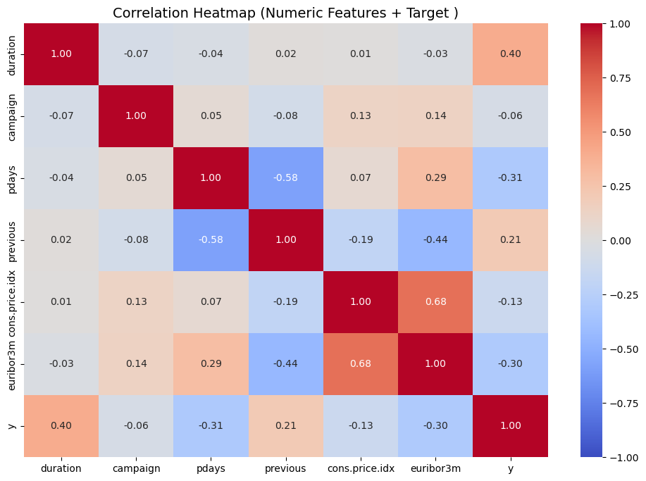

# Robert Meza
Link: [PA3.ipynb](PA3.ipynb)

## Module 17: Practical Application 3

### Problem Statement
The objective of this assignment is to construct and evaluate multiple machine learning classification models for the purpose of assessing marketing campaigns within a banking organization. Specifically, the models to be developed and optimized include k-nearest neighbors, logistic regression, decision trees, and support vector machines. 

### Business Objective
The banking organization has requested an evaluation of the effectiveness of its marketing campaigns in order to determine whether customers are likely to respond positively.

###  Project Workflow
- Data check
- Exploratory Data Analysis (EDA)
- Preprocessing
- Feature Selection
- Classification Modeling
- Results & Analysis

### Data Analysis
The dataset comprises 21 features and more than 40,000 records, including 10 numerical features and 10 categorical features. After one-hot encoding of the categorical variables, the total number of features, prior to evaluation and further processing, was ###. I also performed scaling for the numerical data **after** I split the data in test/train. 

After applying one-hot encoding, the dataset contained more than 50 features for model training and testing. Due to the large proportion of records with "unknown" values, these observations were removed, resulting in a reduction of approximately 10,000 records.

The following table summarizes the strongest correlations.

| Strong correlations with target y: | Value |
| --- | --- |
| duration | 0.403 |
| pdays | -0.312 |
| previous | 0.211 |
| euribor3m | -0.318 |
| poutcome_success | 0.305 |

This can also be shown in the heatmap below: 

Note: the heatmap was done before encoding the categorical values

### Evaluation & Findings

The following table summarizes the classification models, presenting both their initial baseline configurations and their optimized performance metrics.

| Classification Model | Simple Model Accuracy (Test) | Improvement Model Accuracy |
| --- | --- | --- |
| Logistic Regression | 90.6% | 90.7% |
| K-Nearest Neighbors | 89.9%  | 89.0% | 
| Decision Trees | 88.1% | 88.46% |
| Support Vector Machines | 90.0% | - |

✅ For the Logistic Regression model, the optimal regularization parameter (C) was identified as 0.1. However, model performance did not improve following hyperparameter tuning.

✅ For the K-Nearest Neighbors model, the optimal number of neighbors was determined to be 11. Despite this adjustment, no substantive improvement in performance was observed after tuning.

✅ For the Decision Tree model, the optimal maximum depth was identified as 10. Overall performance remained unchanged despite the tuning process.

✅ I chose not to pursue further tuning of the SVM model since the previous three models did not yield any improvement in performance. Based on these outcomes, I concluded that the dataset is highly imbalanced.

✅ Gender is not part of this dataset, why do they reference it??? 

✅ Why are there 43 campaigns found, but the instructions only state 17? 

### Future Work

I plan to dedicate additional time to further tuning this model, as I intend to apply the same approach in my Capstone project. I also anticipate that implementing techniques to better address class imbalance will contribute to improved overall results.

